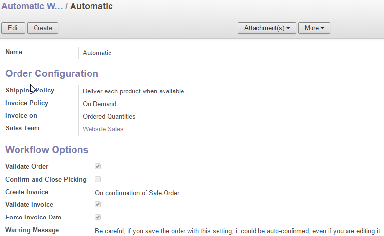
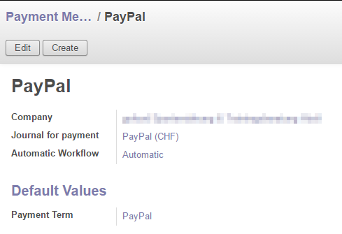
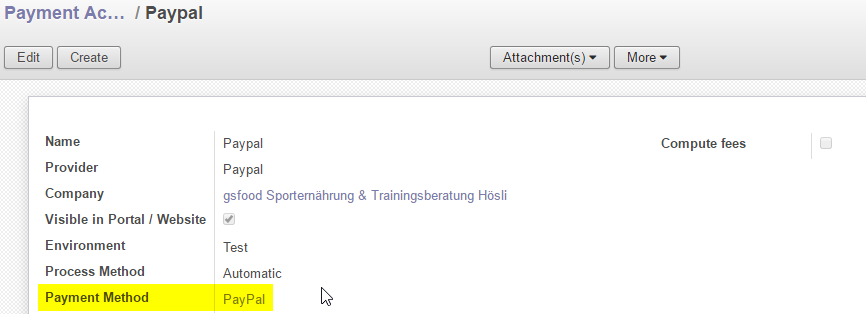

Online Payment with direct invoice reconciliation
=================================================

As known in many other online shops a direct payment (e.g. with credit cards or paypal) should automatically
store the payment in accounting and directly reconcile the invoice when created. So this module will fullfill the
requirements.

.. contents:: Table of Content
   :depth: 2

The following chapters will give you some inputs about configuration and usage of the features:

Installation and Configuration
------------------------------

Installation
^^^^^^^^^^^^

First of all you have to install this module with all depending modules.

Configuration
^^^^^^^^^^^^^

Automatic Workflow
~~~~~~~~~~~~~~~~~~

The automatic workflow can be configured in **Sales > Configuration >
Sales > Automatic Workflow**.

Payment Methods
~~~~~~~~~~~~~~~

The payment methods can be configured in **Sales > Configuration >
Sales > Payment Methods**.

On **Payment Methods** you could associate the **Automatic Workflow** defined above.

Payment Acquirers
~~~~~~~~~~~~~~~~~

The payment acquirers can be configured in **Settings > Payment > Payment Acquirers**.

On **Payment Acquirers** you could associate the **Payment Method** defined above.

Usage
-----

Your customer is buying some products in your Odoo Online Store. When he is making an online payment (e.g. Ogone or PayPal),
the sale order will automatically create an associated account move with payment data based on definition of payment method.

As configured in the payment method and automatic workflow, the sale order attributes will be set to the given values and
the shipping and/or invoice will be created, confirmed, validated, reconciliated as defined.

Todo's
------

- Currenty only tested with paypal and ogone
- The payment is created when state is set to done. No other states are currently used or ch

Changelog
---------

Release 1.0
^^^^^^^^^^^

Features:
~~~~~~~~~

- Automatic Reconciliation when payments are received from odoo payment acquirers

Bugfixes:
~~~~~~~~~

no bugs found yet